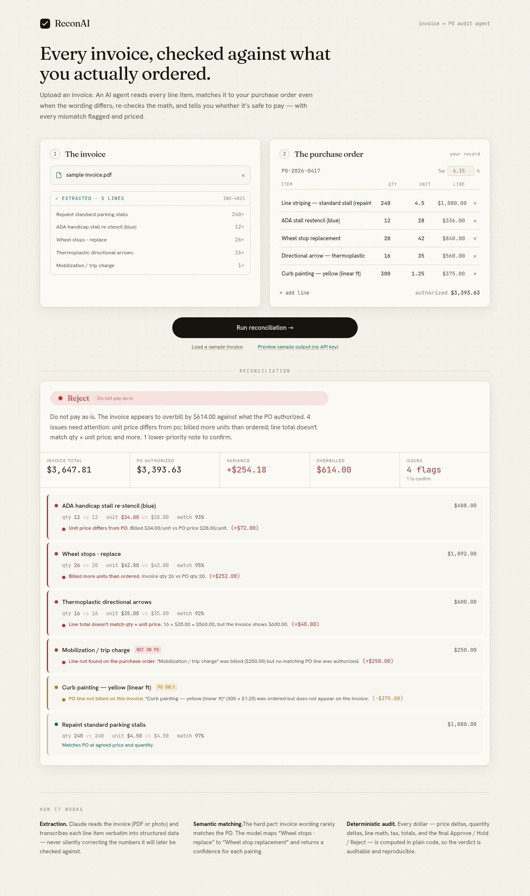

# ReconAI — Invoice ↔ Purchase Order reconciliation agent

Upload a vendor invoice. An AI agent reads every line item, matches each one to
the right line on your purchase order **even when the wording is different**,
re-checks all the arithmetic, and returns an **Approve / Hold / Reject**
recommendation with every mismatch flagged and priced.

It automates the exact back-office task an accounts-payable clerk does by hand:
*"does this invoice actually match what we ordered, and is it safe to pay?"*

> **Live demo:** _paste your deployed URL here_
> **Try it without setup:** click **"Preview sample output (no API key)"** on the
> page — it runs the real reconciliation engine entirely in the browser.



---

## What it does

1. **Extraction** — Claude reads the invoice (PDF or photo) and transcribes each
   line item *exactly as printed* into structured JSON. Crucially, it does **not**
   "fix" numbers that look wrong — the audit depends on seeing the invoice's real
   figures.
2. **Semantic matching** — the hard part. Invoice wording rarely matches the PO
   ("Wheel stops - replace" vs "Wheel stop replacement"). Claude maps each invoice
   line to at most one PO line and returns a confidence score per pairing.
3. **Deterministic audit** — every number is then computed in plain TypeScript:
   unit-price deltas, quantity deltas, per-line math (`qty × price = amount`),
   subtotal / tax / total footing, the total overbilled amount, and the final
   Approve / Hold / Reject decision.

### What it catches

Price mismatches · quantity mismatches · line-item math errors · charges not on
the PO · ordered lines that were never billed · subtotal / tax / total that don't
foot · low-confidence matches a human should eyeball.

---

## The hardest problem: trust boundaries between the model and the math

The instinct is to hand Claude the invoice and the PO and ask "find the
problems." That fails in two directions at once:

- **You can't let the LLM do the arithmetic.** Ask a model whether
  `26 × $42.00 = $1,092.00` and it will usually be right and occasionally,
  confidently, wrong. For something that gates a payment, "usually right" is
  unacceptable and — worse — non-reproducible: the same invoice can get two
  different verdicts.
- **You can't do the matching without the LLM.** The invoice says "ADA handicap
  stall re-stencil (blue)"; the PO says "ADA stall restencil (blue)". A vendor
  reorders words, abbreviates, or merges two PO lines into one invoice line.
  Exact string matching and naive similarity both break on real documents.

So the system draws a hard line. **The model is trusted for exactly one thing:
the fuzzy, semantic judgment of which invoice line corresponds to which PO
line** (`app/api/reconcile/route.ts`). It returns a mapping plus confidences and
nothing else. **Every dollar figure and the final decision are computed
deterministically** in `lib/reconcile.ts`, a pure, dependency-free, unit-tested
function. That makes the verdict auditable and reproducible — you can point at
the exact line of code that decided "reject."

Two smaller problems fell out of that boundary:

- **Extraction faithfulness.** Early prompts had the model silently "correcting"
  a line where `qty × price ≠ amount`, which erased the very error we needed to
  catch. The extraction prompt now explicitly forbids recomputation — transcribe,
  don't fix.
- **Double-counting the money.** A line that's both mis-priced *and* has a math
  error must not have its overage counted twice. Overbilling is measured once
  per line as `billed − authorized`, not as the sum of individual issue impacts.
  (There's a regression test for exactly this.)

---

## Architecture

```
Browser ──► /api/extract  ──► Claude (tool-forced JSON)  ──► ExtractedInvoice
        ──► /api/reconcile ──► Claude (line-mapping only) ──► MatchPair[]
                                └► reconcile()  [pure TS, deterministic]  ──► verdict
```

| Layer | File | Responsibility |
|---|---|---|
| Extraction API | `app/api/extract/route.ts` | PDF/image → structured invoice, via a forced Claude tool call |
| Matching API | `app/api/reconcile/route.ts` | LLM line-mapping, then calls the engine |
| **Engine** | `lib/reconcile.ts` | **All arithmetic + the Approve/Hold/Reject rules. Pure & tested.** |
| Model client | `lib/anthropic.ts` | Tool-forced Claude calls; model set by env |
| Rate limit | `lib/ratelimit.ts` | Per-IP cap so a public demo can't run up the API bill |
| UI | `app/page.tsx`, `components/*` | Upload, editable PO, color-coded results |

Both model calls use tool-forcing (`tool_choice: { type: "tool" }`) so the
output is schema-valid JSON, not prose to parse.

**Stack:** Next.js 16 (App Router, TypeScript) · Anthropic Claude · Tailwind v4 ·
self-hosted variable fonts · deploys to Vercel.

---

## Run it locally

```bash
npm install
cp .env.example .env.local        # add your ANTHROPIC_API_KEY
npm run dev                        # http://localhost:3000
```

Test the deterministic engine (no API key needed):

```bash
npm test
```

---

## Deploy (public link in ~2 minutes)

1. Push this repo to GitHub.
2. Import it at [vercel.com/new](https://vercel.com/new).
3. Add one Environment Variable: `ANTHROPIC_API_KEY`.
4. Deploy. That URL is your shareable live demo.

> **Cost note:** the demo's API key is billed to whoever deploys it. Each run is
> two short Claude calls (fractions of a cent), and `lib/ratelimit.ts` caps
> requests per IP. For a heavily-shared link, swap the in-memory limiter for a
> durable store (Upstash/Redis).

---

## Notes & honest limitations

- Regenerate the sample invoice PDF with `npm run gen:invoice` (headless Chromium).
- The engine assumes one PO per invoice and one-to-one line mapping; split/merge
  billing (one invoice line spanning two PO lines) is flagged as low-confidence
  rather than fully decomposed — a clear next iteration.
- Tax is validated against a single PO-level rate; multi-jurisdiction tax would
  need per-line rates.
